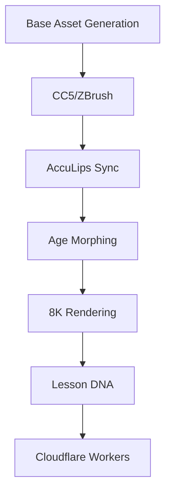

# Kelly Avatar Production Specifications

## Production Workflow Overview

### Complete Pipeline


## Quality Control Dashboard

### Performance Metrics
| Metric               | Target     | Failure Threshold | Current Status |
|----------------------|------------|-------------------|----------------|
| Uncanny Valley Index | ≤0.02      | ≥0.15             | TBD            |
| Lip Sync Accuracy    | 99.9%      | <95%              | TBD            |
| Render Time/Lesson   | <6 hours   | >72 hours         | TBD            |
| Asset File Size      | <500MB     | >1GB              | TBD            |
| Compression Ratio    | 85%        | <70%              | TBD            |

### Quality Gates
1. **Visual Quality:** Passes uncanny valley threshold
2. **Audio Sync:** Frame-accurate lip synchronization
3. **Performance:** Meets render time requirements
4. **File Size:** Optimized for web delivery
5. **Compatibility:** Works across all target platforms

## Asset Naming Convention

### Standard Format
`kelly_{type}_{age}_{perspective}_{res}.ext`

### Naming Components
- **Type:** diffuse, alpha, sprite, physics, video
- **Age:** child, teen, adult, elder, or specific age (25, 45, etc.)
- **Perspective:** front, side, three-quarter, close-up
- **Resolution:** 2k, 4k, 8k, hd, sd
- **Extension:** .png, .mp4, .wav, .json

### Examples
```
kelly_diffuse_25_adult_8k.png
kelly_alpha_12_teen_front_4k.png
kelly_sprite_45_adult_8k.png
kelly_physics_8_child_2k.png
kelly_video_65_elder_4k.mp4
```

## Production Pipeline Details

### Phase 1: Base Asset Generation
**Tools:** Character Creator 5, ZBrush, Runway AI
**Output:** High-quality base character model
**Quality Requirements:**
- 8K texture resolution
- Maximum SubD level 4
- Film-grade skin quality
- Professional hair system

### Phase 2: CC5/ZBrush Processing
**Tools:** Character Creator 5, ZBrush
**Process:**
- Import base asset
- Apply maximum quality settings
- Create HD head with microsurface detail
- Implement professional hair system
- Perfect hairline integration

**Quality Checks:**
- No waxy SSS (Subsurface Scattering)
- Proper skin roughness
- Natural hair movement properties
- No scalp peek-through

### Phase 3: AccuLips Sync
**Tools:** iClone 8, AccuLips
**Process:**
- Import audio file
- Run AccuLips analysis
- Generate viseme keys
- Verify mouth closure accuracy

**Quality Requirements:**
- M/B/P sounds: Full lip closure
- F/V sounds: Lower lip touches teeth
- Frame-accurate synchronization
- Natural mouth movement

### Phase 4: Age Morphing
**Age Buckets:**
- **Child:** 2-12 years
- **Teen:** 13-17 years
- **Young Adult:** 18-35 years
- **Adult:** 36-60 years
- **Elder:** 61-102 years

**Morphing Process:**
- Create age-specific blend shapes
- Adjust facial proportions
- Modify skin texture and tone
- Update hair color and style
- Adjust voice characteristics

### Phase 5: 8K Rendering
**Settings:**
- Resolution: 7680×4320 (8K)
- Format: H.264 MP4
- Bitrate: 50 Mbps
- Frame Rate: 30 fps
- Color Space: Rec. 2020

**Lighting Setup:**
- 3-point studio lighting
- Soft shadows
- Proper catchlights in eyes
- Director's Chair template (85mm lens)

### Phase 6: Lesson DNA Integration
**Components:**
- Video asset references
- Age-specific content
- Interaction triggers
- Progress tracking
- Analytics metadata

### Phase 7: Cloudflare Workers Deployment
**Optimization:**
- Video compression
- CDN distribution
- Edge caching
- Global delivery
- Performance monitoring

## Technical Specifications

### Hardware Requirements
- **CPU:** Intel i7-10700K or equivalent
- **RAM:** 32GB minimum, 64GB recommended
- **GPU:** NVIDIA RTX 3080 or equivalent
- **Storage:** 2TB SSD for asset storage
- **Network:** 1Gbps for cloud uploads

### Software Requirements
- **Character Creator 5:** Latest version
- **iClone 8:** Latest version
- **ZBrush:** 2024 or later
- **FFmpeg:** For video processing
- **Python 3.11:** For automation scripts

### File Formats
- **Images:** PNG (RGBA), 8K resolution
- **Videos:** MP4 (H.264), 4K/8K
- **Audio:** WAV (48kHz, 16-bit)
- **Data:** JSON for metadata
- **Physics:** PDF for reference sheets

## Quality Assurance Process

### Pre-Production
1. **Asset Validation**
   - Verify source image quality
   - Check naming convention compliance
   - Validate file formats

2. **Technical Setup**
   - Calibrate monitors
   - Verify software versions
   - Test hardware performance

### During Production
1. **Real-time Monitoring**
   - Track render progress
   - Monitor system resources
   - Check for errors

2. **Quality Checks**
   - Visual inspection
   - Audio sync verification
   - File size validation

### Post-Production
1. **Final Review**
   - Complete quality assessment
   - Performance testing
   - Compatibility verification

2. **Delivery Preparation**
   - File compression
   - Metadata generation
   - Cloud upload

## Troubleshooting Guide

### Common Issues
1. **Poor Lip Sync**
   - Check audio quality
   - Verify AccuLips settings
   - Adjust viseme strength

2. **Render Quality Issues**
   - Increase render settings
   - Check lighting setup
   - Verify material properties

3. **File Size Problems**
   - Adjust compression settings
   - Optimize textures
   - Reduce resolution if needed

4. **Performance Issues**
   - Check hardware resources
   - Optimize render settings
   - Use batch processing

## Success Metrics

### Production Efficiency
- **Target:** 6 hours per lesson
- **Current:** TBD
- **Improvement:** Automation scripts

### Quality Consistency
- **Target:** 99.9% pass rate
- **Current:** TBD
- **Improvement:** Standardized processes

### Cost Optimization
- **Target:** <$50 per lesson
- **Current:** TBD
- **Improvement:** Batch processing

---

**Document Owner:** Nicolette Rankin  
**Last Updated:** October 18, 2025  
**Next Review:** November 1, 2025
