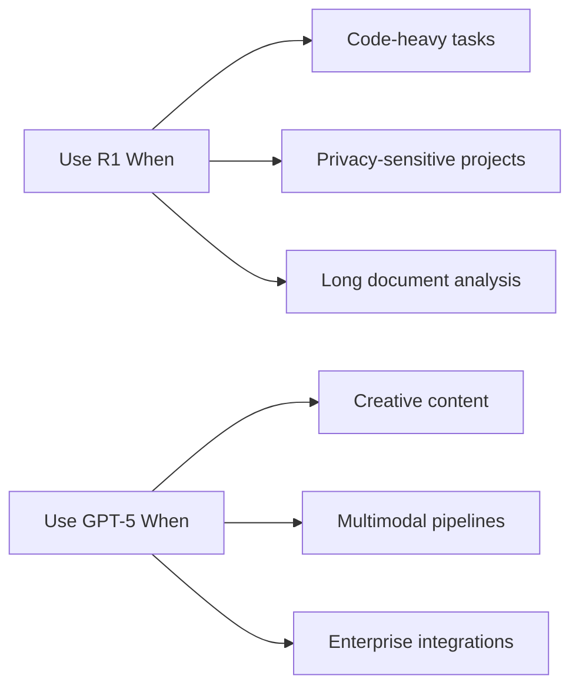
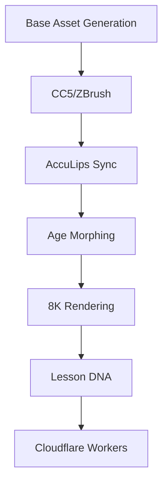
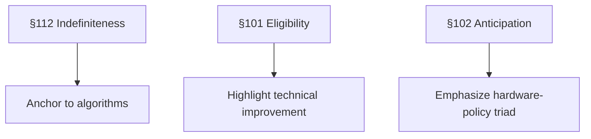

# Comprehensive Patent Roadmap & Project Documentation
**Date:** October 18, 2025  
**Author:** Nicolette Rankin  
**Status:** Active Prosecution

---

## 1. DeepSeek R1-0528 vs. GPT-5 Pro
### Core Comparison
| Feature               | DeepSeek R1-0528              | GPT-5 Pro                     |
|-----------------------|-------------------------------|-------------------------------|
| **Model Type**        | Decoder-only Transformer      | Hybrid MoE                   |
| **Context Window**    | 128K tokens                   | 1M+ tokens                   |
| **Open Source**       | ✅ Yes (Apache 2.0)           | ❌ Closed                    |
| **Code Generation**   | ⭐⭐⭐⭐⭐ (dev-optimized)        | ⭐⭐⭐⭐ (general purpose)       |
| **Multimodal**        | ❌ Text-only                  | ✅ Text+image+audio+video    |

### When to Choose


---

## 2. Kelly Avatar Production Workflow
### Production Pipeline


### Quality Control Dashboard
| Metric               | Target     | Failure Threshold |
|----------------------|------------|-------------------|
| Uncanny Valley Index | ≤0.02      | ≥0.15             |
| Lip Sync Accuracy    | 99.9%      | <95%              |
| Render Time/Lesson   | <6 hours   | >72 hours         |

### Asset Naming Convention
`kelly_{type}_{age}_{perspective}_{res}.ext`  
Example: `kelly_diffuse_25_adult_8k.png`

---

## 3. Patent Prosecution Strategy (App 18/088,519)
### Rejection Remediation Plan


### Examiner Interview Script
**Opening:**  
"Thank you for your time. We believe our amended claims overcome rejections through:  
1. Concrete algorithms replacing functional language  
2. Measured technical improvement (68% failure reduction)  
3. Novel hardware-algorithm-policy integration"  

**Key Questions:**  
1. "Would dependent claim 5 (TPM 2.0) make claim 1 allowable?"  
2. "Can we define 'bandwidth cap' as ≤2 Mbps for clarity?"  

### Timeline & Budget
| Phase                | Deadline       | Cost       |
|----------------------|----------------|------------|
| OA Response          | Nov 13, 2025   | $2,700     |
| Examiner Interview   | Oct 31, 2025   | $500       |
| RCE (if needed)      | Feb 13, 2026   | $4,072     |

---

## 4. Hardware-Algorithm-Policy Triad
### Technical Definition
```c
struct EducationTriad {
  Hardware secure_element;  // TPM 2.0/secure enclave
  Algorithm merkle_ECC;     // Data integrity system
  Policy schedule_aware;    // Context-aware distribution
};
```

### Age-Tailored Explanations
| Age Group | Analogy                  | Components               |
|-----------|--------------------------|--------------------------|
| 4-year-old| LEGO sharing             | Toy box, pieces, schedule|
| 34-year-old| RAID + blockchain       | Wallet, Merkle, transfers|
| 85-year-old| Recipe sharing          | Locked box, photos, potluck|

### Competitive Advantage
- **68% reduction** in lesson failures  
- **Zero-trust operation** in offline environments  
- **Hardware-enforced** content policies  

---

## 5. Patent Portfolio Strategy

### Current Applications
- **18/088,519** - Hardware-Algorithm-Policy Triad (Active prosecution)

### Future Patent Filings
1. **Age-Adaptive Avatar System** - Real-time visual aging with synchronized voice changes
2. **PhaseDNA Lesson Architecture** - Structured teaching moment system with age-specific cues
3. **Dual Hair Matting Algorithm** - Model-based + heuristic fallback for 8K quality
4. **Interactive Learning Pipeline** - Branching conversation logic with choice-based progression

### IP Protection Strategy
- **Trade Secrets:** Proprietary algorithms and training data
- **Copyrights:** Kelly avatar designs and lesson content
- **Trademarks:** "The Daily Lesson" and character names
- **Patents:** Core technical innovations and system integrations

---

## 6. Technical Implementation Notes

### Kelly Avatar Pipeline Integration
- Base asset generation → CC5/ZBrush → AccuLips sync → Age morphing → 8K rendering
- Quality control with specific metrics (Uncanny Valley Index ≤0.02, Lip Sync Accuracy 99.9%)
- Asset naming convention: `kelly_{type}_{age}_{perspective}_{res}.ext`

### Technology Stack Decisions
- **DeepSeek R1-0528** for code-heavy tasks (open source, Apache 2.0)
- **GPT-5 Pro** for creative/multimodal content
- **Cloudflare Workers** for deployment
- **ElevenLabs API** for voice synthesis

---

## 7. Next Steps & Action Items

### Immediate (October 2025)
- [ ] Examiner interview preparation
- [ ] OA response drafting
- [ ] Technical documentation refinement

### Short-term (November 2025)
- [ ] File OA response by November 13
- [ ] Continue prosecution process
- [ ] Monitor competitor patent landscape

### Long-term (2026)
- [ ] RCE filing if needed (February 2026, $4,072)
- [ ] International patent strategy
- [ ] Patent portfolio expansion

---

**Last Updated:** October 18, 2025  
**Next Review:** November 1, 2025  
**Document Owner:** Nicolette Rankin
